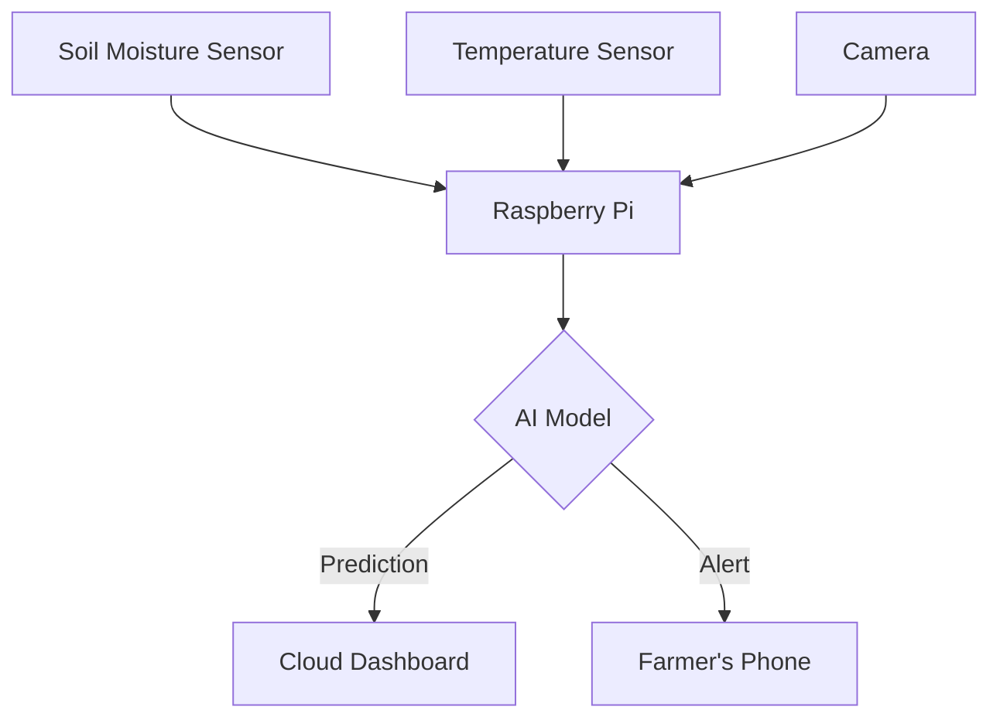

AI-Driven Smart Agriculture System Proposal
Objective: Deploy an IoT and AI-powered system to optimize crop yield through real-time monitoring and predictive analytics.

1. Sensors Required
Sensor	Parameter Measured	Example Model
Soil Moisture	Water content (%)	Capacitive Sensor v2.0
Temperature/Humidity	Ambient conditions (°C, %)	DHT22
NPK Sensor	Nitrogen, Phosphorus, Potassium	JXCT-IO3
Light Intensity	Sunlight exposure (lux)	BH1750
Camera Module	Pest/disease detection	Raspberry Pi Camera v2
2. AI Model for Yield Prediction
Model Type: Hybrid LSTM + CNN

LSTM: Processes time-series sensor data (soil moisture, temp trends).

CNN: Analyzes camera images for pest/disease detection.

Input Features:

python
[soil_moisture, temperature, humidity, NPK_levels, light_intensity, pest_detection_score]
Output: Predicted yield (kg/ha) ± confidence interval.

3. Data Flow Diagram

4. Benefits
Resource Efficiency: Reduce water/fertilizer waste by 30%.

Early Pest Detection: Minimize crop loss with real-time alerts.

Scalability: Adaptable to farms of all sizes.

5. Future Work
Integrate drone imagery for large-area monitoring.

Use Edge TPU for faster on-device AI inference.
