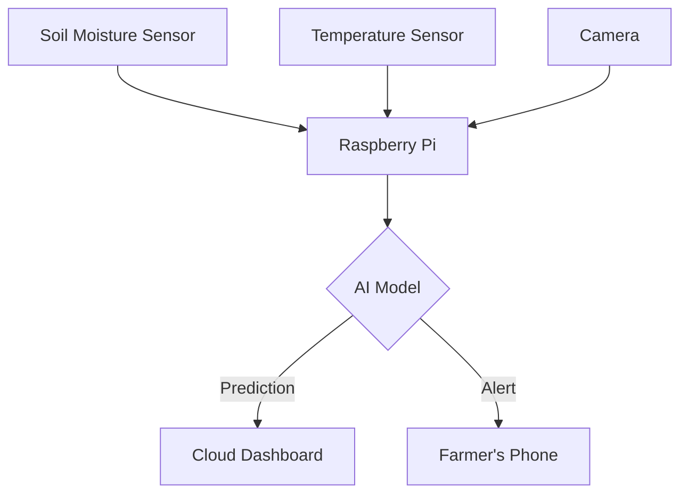

+-------------------+       +---------------------+       +-------------------+  
|    IoT Sensors    | ----> | Edge Device (RPi)   | ----> | Cloud/Server      |  
+-------------------+       +---------------------+       +-------------------+  
  │  │  │  │                   │                            │  
  │  │  │  └─ Soil Moisture    │                            └─ Dashboard (Web/Mobile)  
  │  │  └─ Temperature         │  
  │  └─ Humidity               └── AI Model (LSTM/CNN) ───> Farmer Alerts (SMS)  
  └─ Camera (Pest Detection)  
